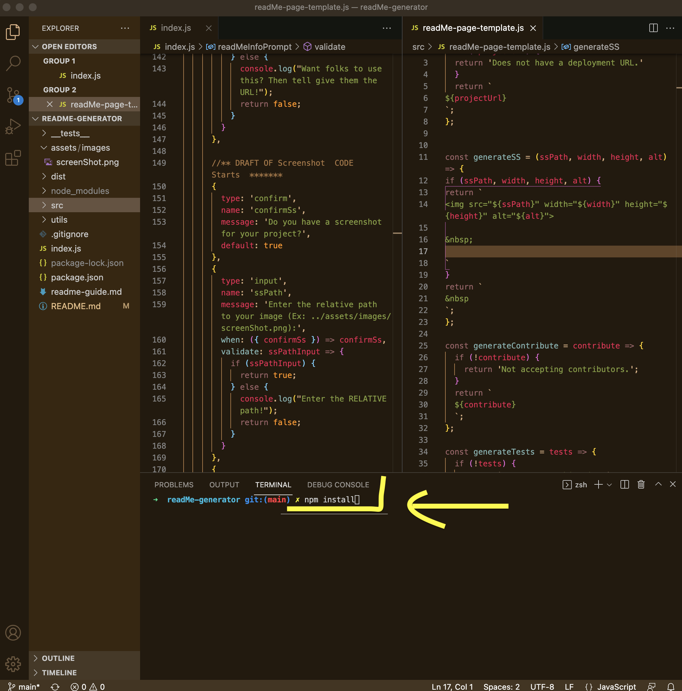

# **README Generator**
&nbsp;

&nbsp;

## **Project Description**
***
This command line app quickly generates a quality README.md file by asking the user questions. Each answer is then displayed under the appropriate heading in a README.md file. README Generator frees up time for  busy developers, ensures READMEs have the same format across a users projects, and is easily customizable.

&nbsp;

## Table of Contents
***
* [Installation](#installation)
* [Usage](#usage)
* [URL](#url)
* [Screenshot](#screenshot)
* [Contributing](#contributing)
* [Tests](#tests)
* [Resources](#resources)
* [Questions](#questions)
* [License](#license)

&nbsp;

## **Installation**
***
Ensure you have Node installed. Fork the repo. Clone to local directory. Install npm package: from command line, in the main program directory, type: npm install. Program runs from the index.js file: from command line, in the main program directory, type: node index. (Also uses inquirer and node fs dependencies which are called in the code.)

&nbsp;

## **Usage**
***
Answer the questions when prompted. Hints: Do not start any answer with the space bar (README.md will generate, but not correctly formatted.) Use '< / br >' (without spaces) for line breaks or after the last word/character of a list item. If the screenshot doesn't show, check your relative path, or try changing the number of '.' at the start. At this time, only one image can be added through the prompts; if you have more they are easy to add manually in the generated the README.md file. To customize, delete or comment out unwanted questions in the index file and corresponding section andor function in the readMe-page-template file; add your own questions and corresponding section andor function in the readMe-page-template file.

&nbsp;

## **URL**
***
Does not have a deployment URL.
[README Generator run through on  YouTube](https://youtu.be/xJcX6qopbIg)

&nbsp;

## **Screenshot**
***

&nbsp;

&nbsp;

&nbsp;

&nbsp;

### **Contributing**
***
Not accepting contributors.

&nbsp;

### **Tests**
***
No tests at this time.

&nbsp;

### **Resources**
***

  https://www.contributor-covenant.org/ https://shields.io/ https://choosealicense.com/ https://github.com/MatWilmot/pizza-order-builder https://github.com/MatWilmot/pizza-order-builder/blob/master/inquirer.js https://stackoverflow.com/questions/42964102/syntax-for-an-async-arrow-function https://hustakin.github.io/bestpractice/adding-beautiful-badges-into-the-markdown/ https://www.digitalocean.com/community/tutorials/understanding-template-literals-in-javascript https://www.contributor-covenant.org/
  

&nbsp;

### **Questions**
***
Reach me directly at  mongabay00@outlook.com    
Or checkout out my GitHub profile:  [github.com/melliedee](https://github.com/melliedee)

&nbsp;

### **License**
***
Copyright (c) Melanie Dubberley. 

Licensed under the [Apache 2.0](https://choosealicense.com/licenses) license.
    
&nbsp;
      
 

##### Return to:
***
* [Installation](#installation)
* [Usage](#usage)
* [URL](#url)
* [Screenshot](#screenshot)
* [Contributing](#contributing)
* [Tests](#tests)
* [Resources](#resources)
* [Questions](#questions)
* [License](#license)

&nbsp;

